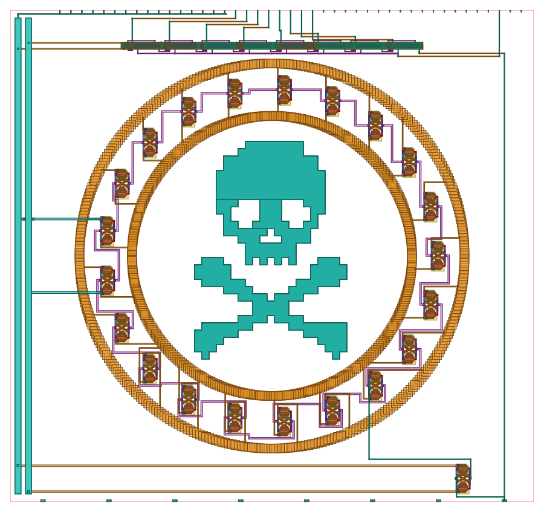
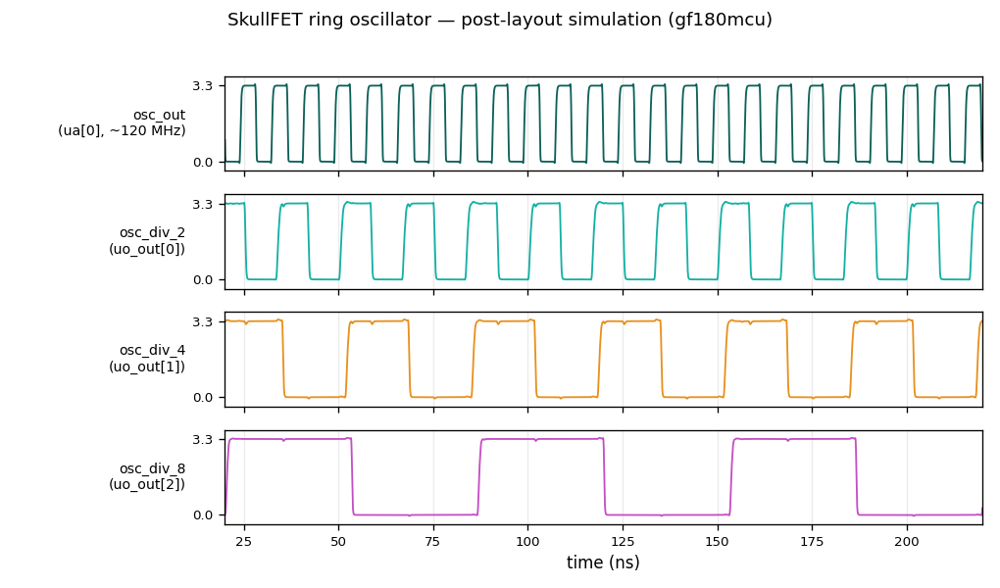

<!---

This file is used to generate your project datasheet. Please fill in the information below and delete any unused
sections.

You can also include images in this folder and reference them in the markdown. Each image must be less than
512 kb in size, and the combined size of all images must be less than 1 MB.
-->

## How it works

A stylish ring oscillator built from **SkullFET** transistors — MOSFETs hand-drawn in the shape
of skulls. A chain of 21 SkullFET inverters forms a ring oscillator that generates a ~120 MHz
square wave; an **8-bit ripple divider** then produces /2 through /256 taps on `uo_out[0..7]`. The
raw oscillation is brought out on the analog pin `ua[0]` through **one more SkullFET wired as a
buffer**, so an external probe/load on `ua[0]` can't pull the ring frequency.

This is the **gf180mcu** (GlobalFoundries 180nm) port of the design, migrated from the original
IHP sg13g2 version. The SkullFETs are **3.3V devices** running directly on the 3.3V core supply
(VDPWR). The skull artwork is preserved verbatim from the original; only the layer stack, device
implants and feature sizes were retargeted to gf180mcuD (a uniform 1.45× scale clears the 180nm
width/spacing/gate rules; grid-snap, exact-cut and metal-slot passes then make it KLayout
sign-off-clean — see `scripts/remap_to_gf180.py`).

| Pin       | Signal             | Post-layout frequency |
|-----------|--------------------|-----------------------|
| ua[0]     | osc_out (buffered raw 3.3V oscillation) | ~120 MHz |
| uo_out[0] | osc_div_2          | ~60 MHz   |
| uo_out[1] | osc_div_4          | ~30 MHz   |
| uo_out[2] | osc_div_8          | ~15 MHz   |
| uo_out[3] | osc_div_16         | ~7.5 MHz  |
| uo_out[4] | osc_div_32         | ~3.7 MHz  |
| uo_out[5] | osc_div_64         | ~1.9 MHz  |
| uo_out[6] | osc_div_128        | ~0.94 MHz |
| uo_out[7] | osc_div_256        | ~0.47 MHz |

(`uo_out[0]` is the LSB / ÷2, `uo_out[7]` the MSB / ÷256.) All unused outputs — `uio_out[7:0]` and
the output-enables `uio_oe[7:0]` — are tied low in the macro, so the bidirectional pads stay in
input mode.

**Post-layout simulation** (extract the hardened GDS with magic, simulate with the gf180mcuD
ngspice models — run `make sim`): the ring oscillates **rail-to-rail at ~120 MHz** and the 8-stage
divider produces clean **/2 .. /256** taps. The testbench supplies only VDPWR/VGND and the substrate
bias — it does **not** force any std-cell rail or device well, so the result reflects the actual
extracted connectivity (every pfet body is tied to VDPWR through its n-well tap, every std-cell rail
is strapped to VDPWR/VGND — nothing floats). With the buffer, a swept capacitive load on `ua[0]`
(0→10 pF) leaves the ring frequency **unchanged** at ~120 MHz; without it the same load would drop
the ring 25–60 %.

## Simulation results

`osc_out` (the buffered ~120 MHz oscillation on `ua[0]`) and the first three divider taps, captured
from the post-layout netlist (`make plot`):

## Reset

`rst_n` (active-low) resets **only the divider** — it asynchronously clears all eight flip-flops,
so while `rst_n` is held low the divided taps `uo_out[0..7]` sit at 0. The 21-stage ring oscillator
has no reset and free-runs whenever the design is powered, so `ua[0]` keeps oscillating at full
speed even during reset. Release `rst_n` (high) and the divider starts counting from a known phase.
`clk` and `ena` are not used — the ring self-clocks the divider.

## How to test

Connect an oscilloscope to a low divider tap such as **`uo_out[7]` (÷256, ~0.5 MHz)** or
**`uo_out[4]` (÷32, ~3.7 MHz)** — scope-friendly. The fast taps and the buffered `ua[0]` (~120 MHz)
exceed typical GPIO bandwidth, so the analog pin **`ua[0]`** is the place to look for the raw
oscillation. Note that `uo_out[0..7]` stay at 0 until you release `rst_n`.

## External hardware

None — just an oscilloscope.
